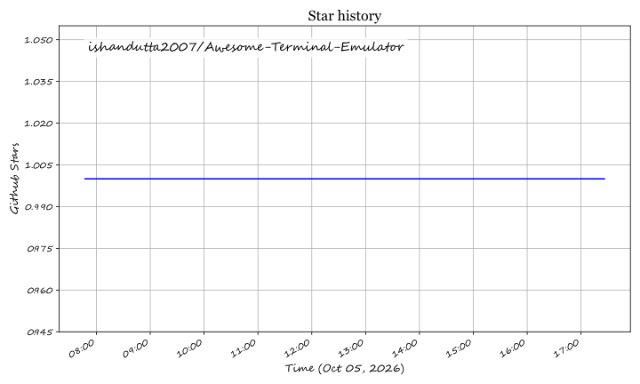

# ⚡ Awesome Terminal Emulator Ecosystem 🚀

  
  
  
  

---

## 📌 Executive Summary & Ecosystem Overview

Welcome to the **Awesome Terminal Emulator Ecosystem** — the premier curated directory of top-tier **command-line interfaces (CLI)**, **GPU-accelerated terminal emulators**, **SSH remote management suites**, and **terminal multiplexers**.

Whether you are seeking zero-latency Rust-based terminals (Alacritty, WezTerm, Ghostty), modern AI-assisted workspaces (Warp, Wave), robust Windows remote access tools (MobaXterm, Tabby), or classic Unix multiplexers (tmux, Zellij), this list provides empirical benchmarks, pricing breakdowns, and star ratings.

---

## 📑 Table of Contents

- [🏢 SaaS \& Commercial Platforms](#-saas--commercial-platforms)
- [🌟 Open-Source GitHub Projects](#-open-source-github-projects)
- [🔀 Terminal Multiplexers](#-terminal-multiplexers)
- [🛠️ Additional Notable Shells \& Tools](#️-additional-notable-shells--tools)
- [🤝 How to Contribute](#-how-to-contribute)
- [⚠️ Disclaimer](#️-disclaimer)
- [⭐ Star History](#-star-history)
- [❤️ Support \& Community](#%EF%B8%8F-support--community)

---

## 🏢 SaaS & Commercial Platforms

> 💡 **Market Size & Structure**: The terminal emulator and developer CLI environment market forms a critical component of the **$25B+ global developer tools market**. The sector is **highly fragmented**, characterized by open-source community dominance (Windows Terminal, Alacritty, Kitty, WezTerm) alongside emerging commercial AI-first platforms (Warp) and specialized enterprise SSH management suites (Termius, MobaXterm).

### 📊 SaaS Comparison Matrix

| Product 🖥️ | Description 📝 | Company Size (Valuation / Revenue) 💰 | Pricing (Paid Tiers) 💳 | Free Tier Limit 🆓 |
| :--- | :--- | :--- | :--- | :--- |
| **[Warp](https://www.warp.dev/)** | AI-native, Rust-built terminal with blocks UI, natural language commands & team collaborative notebooks. | **$100M+ Valuation** ($23M Series A led by GV) | **$12 / user / month** (Team Plan) / **$50 / user / month** (Enterprise) | Max 100 AI request credits / month & up to 5 team members |
| **[Termius](https://termius.com/)** | Cross-platform SSH client, SFTP manager, and terminal with cloud snippet & key sync across desktop & mobile. | **$20M+ Revenue** (YC Alum, 1M+ active engineers) | **$10 / user / month** (Pro Plan) / **$20 / user / month** (Team) | Starter Plan: Basic single-device SSH client without cloud sync |
| **[MobaXterm](https://mobaxterm.mobatek.net/)** | All-in-one Windows terminal suite with built-in X11 server, SFTP browser, RDP/VNC, and remote session tools. | **$5M - $10M Revenue** (Mobatek SAS) | **$69.00 / user** (Professional Edition one-time license) | Home Edition: Max 12 SSH/SFTP sessions, 2 RDP/VNC sessions, 4 macros |
| **[iTerm2](https://iterm2.com/)** | Popular macOS-focused terminal emulator featuring split panes, autocomplete, triggers, and search. | **Donation Funded** ($50K+/yr community supported) | **$0.00** (100% Free & Open Source - GPL-2.0) | Unlimited Free Forever: Full feature set with zero restrictions |
| **[PuTTY](https://www.putty.org/)** | Classic lightweight Windows SSH and telnet client with terminal emulation. | **Open-Source Community** (Maintained by Simon Tatham) | **$0.00** (100% Free & Open Source - MIT) | Unlimited Free Forever: Full feature set with zero restrictions |

---

## 🌟 Open-Source GitHub Projects

Below is a curated list of top open-source terminal emulators, ranked strictly by **GitHub Stars_Count (descending)**.

1. 🌟 **[Windows Terminal](https://github.com/microsoft/terminal)**   
   **Microsoft's official modern, GPU-accelerated terminal for Windows**. Built with DirectWrite/DirectX, multi-tab support, dynamic split panes, rich Unicode/emoji rendering, and native WSL / PowerShell integration.

2. 🌟 **[Tabby](https://github.com/Eugeny/tabby)**   
   **Cross-platform terminal for SSH, Serial, and local shells**. Feature-packed open-source alternative to MobaXterm built with Electron and TypeScript, featuring SFTP client, port forwarding, and custom themes.

3. 🌟 **[Alacritty](https://github.com/alacritty/alacritty)**   
   **The benchmark GPU-accelerated terminal emulator**. Written in Rust with an intense focus on raw speed and minimal resource consumption. Designed to be paired with terminal multiplexers like tmux.

4. 🌟 **[Termux](https://github.com/termux/termux-app)**   
   **Android terminal emulator and Linux environment**. Provides complete APT package management, allowing execution of Python, Node.js, Git, and C/C++ directly on mobile devices without root.

5. 🌟 **[Ghostty](https://github.com/ghostty-org/ghostty)**   
   **Next-generation cross-platform GPU terminal** by Mitchell Hashimoto (HashiCorp co-founder). Features native platform GUI toolkits (GTK on Linux, AppKit on macOS) without web runtime overhead.

6. 🌟 **[Hyper](https://github.com/vercel/hyper)**   
   **Extensible Electron terminal application built on HTML/CSS/JS** by Vercel. Fully customizable using JavaScript extensions and npm plugins.

7. 🌟 **[Kitty](https://github.com/kovidgoyal/kitty)**   
   **Feature-packed GPU terminal with Python extensibility**. Supports native image display, socket remote control, kittens (extensible terminal scripts), and custom font ligatures.

8. 🌟 **[WezTerm](https://github.com/wezterm/wezterm)**   
   **Cross-platform GPU terminal emulator and multiplexer** written in Rust with Lua configuration support. Offers SSH/TLS remote domains, tab/pane tiling, and built-in graphics protocols.

9. 🌟 **[Wave Terminal](https://github.com/wavetermdev/waveterm)**   
   **Modern open-source AI terminal emulator**. Integrates inline file previews, web browser widgets, and LLM assistance directly into the command line canvas.

10. 🌟 **[ConEmu](https://github.com/Maximus5/ConEmu)**   
    **Mature Windows console window emulator**. Hosts multiple command-line shells, GUI applications, tabs, and customizable key bindings.

11. 🌟 **[Rio](https://github.com/raphamorim/rio)**   
    **Hardware-accelerated terminal built with Rust and WebGPU**. Focuses on low latency, font ligatures, and modern cross-platform rendering.

12. 🌟 **[Tilix](https://github.com/gnunn1/tilix)**   
    **GTK3 tiling terminal emulator for Linux**. Follows GNOME Human Interface Guidelines with split panes, quake dropdown mode, and layout save/restore.

13. 🌟 **[Guake](https://github.com/Guake/guake)**   
    **Top-down drop-down Quake-style terminal for GNOME**. Instantly toggled via hotkey for quick system operations.

14. 🌟 **[Terminator](https://github.com/gnome-terminator/terminator)**   
    **Flexible Linux terminal with grid pane splitting**. Allows users to fill screens with multiple terminal panes and broadcast commands across windows.

---

## 🔀 Terminal Multiplexers

Terminal multiplexers allow running multiple terminal sessions inside a single window, persisting remote SSH connections, and splitting screens into custom arrangements.

1. ⚡ **[tmux](https://github.com/tmux/tmux)**   
   **The industry-standard terminal multiplexer**. Enables detachment/reattachment of persistent background sessions, window tabs, and flexible pane layouts.

2. ⚡ **[Zellij](https://github.com/zellij-org/zellij)**   
   **User-friendly terminal workspace and multiplexer in Rust**. Offers floating panes, discoverable UI keybindings, dynamic layouts, and WebAssembly plugin architecture.

3. ⚡ **[GNU Screen](https://www.gnu.org/software/screen/)**  
   **The classic Unix terminal session manager**. Provides basic session persistence and window splitting across legacy Linux and BSD deployments.

4. ⚡ **[abduco](https://github.com/martanne/abduco)**   
   **Lightweight session attachment/detachment tool**. Provides process persistence without window management overhead.

---

## 🛠️ Additional Notable Shells & Tools

- 🐧 **GNOME Terminal** — The classic default GTK terminal for GNOME desktops.
- 💻 **Konsole** — Powerful KDE terminal supporting tabs, profiles, and background monitoring.
- ⚡ **st (Simple Terminal)** — Ultra-minimalist C terminal by suckless.org for power users.
- 🎨 **Terminology** — Enlightenment desktop terminal with inline image and video rendering.
- 🌊 **Foot** — Fast, lightweight, Wayland-native terminal emulator.

---

## 🤝 How to Contribute

Contributions are warmly welcome! To add a new terminal tool or update existing benchmarks:

1. Fork this repository.
2. Update `README.md` following the established formatting and table schema.
3. Ensure open-source projects include Stars_Count social badges linking to `/stargazers`.
4. Open a Pull Request with a clear concise summary.

*See also our meta repository: [Awesome-Awesome-Awesome](https://github.com/ishandutta2007/Awesome-Awesome-Awesome)*

---

## ⚠️ Disclaimer

- This list is **community-curated** for educational and productivity evaluation purposes.
- Terminal emulators process credentials, shell logs, and sensitive session data. Always review security policies and telemetry settings (especially for AI-assisted tools).
- GPU-accelerated terminals require system OpenGL 3.3+, Vulkan, or Apple Metal driver support.

---

## ⭐ Star History

---

## ❤️ Support & Community

Thank you for exploring **Awesome-Terminal-Emulator**! If this repository helped you find your ideal terminal emulator or CLI workspace setup, please consider supporting the project:

- ⭐ **Star** this repository to show appreciation and help others discover it.
- 🔀 **Fork** and contribute new features, updates, or tools.
- 📢 **Share** with developers, DevOps engineers, and Linux power users.

☕ **Sponsor / Buy me a coffee**:  

## Star History

<a href="https://star-history.com/#ishandutta2007/Awesome-Terminal-Emulator&Timeline" align="center">
  <picture>
    <source media="(prefers-color-scheme: dark)" srcset="assets/ishandutta2007_Awesome-Terminal-Emulator_growth.svg">
    
  </picture>
</a>
